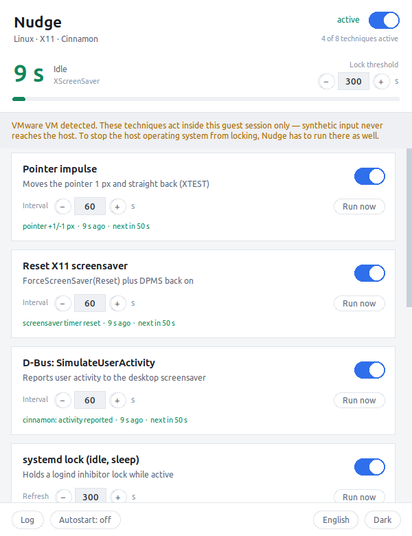

# Nudge

Keeps a workstation from going idle — and proves whether it is working.

Fifteen individual anti-idle techniques, each switchable on its own interval,
plus a live idle counter that shows you in real time whether a technique
actually reaches the system's idle timer. Runs on Linux and Windows.


**No dependencies beyond Python and tkinter. No `pip` required.** That is a
deliberate design constraint: on a locked-down corporate machine, a package
download is usually the point where everything else fails.

---

## Read this first: guests and hosts are separate

If you run Nudge inside a virtual machine, every technique acts **inside that
VM only**. The host never sees it.

The reason is the direction in which input events flow:

| What happens | Path | Effect |
|---|---|---|
| You move the real mouse | The driver in the **host** creates the event, the host resets its own idle counter, then forwards the movement to the guest | Host **and** guest stay awake |
| Nudge creates a movement in the guest | XTEST or uinput creates the event **in the guest** | Only the guest stays awake |

There is no return channel from the guest into the host's input stack. To stop
a host operating system from locking, Nudge has to run **on the host**. It
detects virtualisation on its own and shows a banner saying so.

---

## Install

### Linux

```bash
git clone <repository-url> nudge
cd nudge
./nudge.sh
```

If tkinter is missing: `sudo apt install python3-tk`

Optional, improves individual techniques:

```bash
sudo apt install python3-xlib python3-dbus python3-evdev xdotool
```

Without `python3-xlib` Nudge falls back to `xdotool`, without `python3-dbus` to
`gdbus`. Only the uinput technique has no substitute.

### Windows

```bat
python -m nudge
```

Or double-click `nudge.pyw` — the `.pyw` extension launches `pythonw.exe`, so
no console window appears.

**If Python is not installed**, check first:

```bat
python --version
python -c "import tkinter; print('tkinter ok')"
```

Both must succeed. If not, try these in order — none of them needs
administrator rights:

1. **Microsoft Store**, package "Python 3.12". Installs into the user profile,
   includes tkinter, allowed in many corporate environments.
2. **python.org** installer with the *Install for me only* option.
3. **WinPython** as a portable ZIP. Extracted rather than installed, ships
   with tkinter.

Do **not** use the "Windows embeddable package" from python.org — it has no
tkinter and the interface will not start.

---

## What it looks like

| Light theme | Technique detail and log |
|---|---|
|  |  |

A technique that cannot run on this machine explains why, and what would fix
it:


---

## Features

- **15 techniques**, 8 for Linux and 7 for Windows, each with its own on/off
  switch and interval
- **Live idle counter** reading `GetLastInputInfo` on Windows and the
  XScreenSaver extension on X11, with a bar filling toward a configurable lock
  threshold
- **Honest availability reporting** — an unusable technique says what is
  missing and gives the exact command to fix it
- **English and German**, switchable at runtime; already-logged lines are
  retranslated too
- **Dark and light theme**
- **Autostart** on both platforms, written into the user profile, no admin
  rights needed
- **Headless mode** for running without a window

---

## Documentation

- **[User guide](docs/USER_GUIDE.md)** — the window explained, how to pick a
  technique that works, every technique described, troubleshooting
- **[Technical documentation](docs/TECHNICAL.md)** — architecture, threading
  model, platform APIs, and how to add a technique or a language

---

## Command line

```
python -m nudge              start the interface
python -m nudge --list       show techniques and their availability
python -m nudge --headless   run without a window
python -m nudge --language de
```

---

## A note on scope

Nudge prevents idle locks. Where such a lock is mandated by a corporate
policy, working around it is a matter between you and your IT department —
and for a lasting need, a requested exception is a better route than a tool
that works against the policy.
