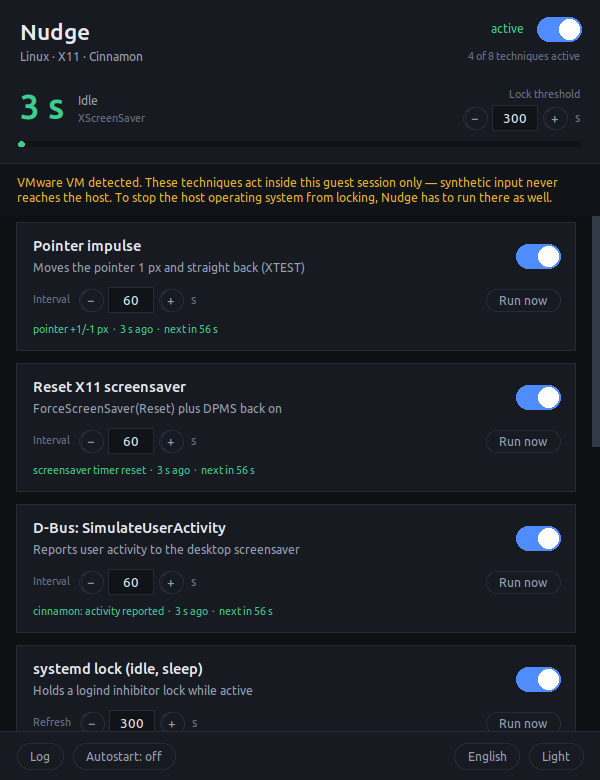
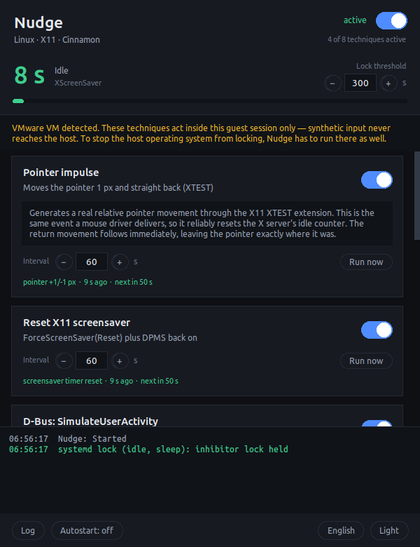
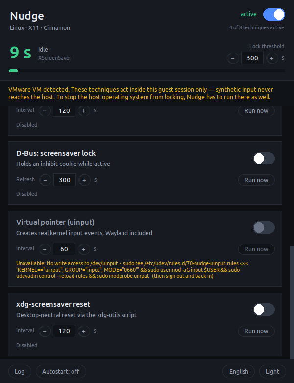

# Nudge — User Guide

## Contents

- [The idea in one paragraph](#the-idea-in-one-paragraph)
- [Starting Nudge](#starting-nudge)
- [The window, part by part](#the-window-part-by-part)
- [Finding a technique that works](#finding-a-technique-that-works)
- [Technique reference](#technique-reference)
- [Intervals](#intervals)
- [Language, theme, autostart](#language-theme-autostart)
- [Running without a window](#running-without-a-window)
- [Where settings are stored](#where-settings-are-stored)
- [Troubleshooting](#troubleshooting)

---

## The idea in one paragraph

Every operating system keeps a counter of how long it has been since the user
last touched the keyboard or mouse. Screen locks, screensavers and power
management all read that counter. Nudge repeatedly does something that is
supposed to reset it — and at the same time it *displays* the counter, so you
can see whether the attempt landed. That second half is the point. Tools like
Caffeine do the first half and leave you guessing.

---

## Starting Nudge

**Linux:** `./nudge.sh` from the installation directory.

**Windows:** double-click `nudge.pyw`, or run `python -m nudge`.

Nothing happens until you turn on the master switch in the top right. Nudge
starts paused on purpose.

---

## The window, part by part



### Header

The title line shows which system Nudge thinks it is on — for example
`Linux · X11 · Cinnamon` or `Windows 11`. If a technique behaves unexpectedly,
check this first; it tells you which set of techniques got loaded.

The **master switch** on the right starts and stops everything at once.
Individual technique switches keep their state while paused, so you can
prepare a configuration and then enable it in one click. Underneath it, a
counter shows how many techniques are currently doing work.

### Idle counter

The large number is the heart of the tool: **how long the session has been
without user input.**

- On Windows it comes from `GetLastInputInfo`
- On X11 it comes from the XScreenSaver extension

The small grey line underneath names which of the two is in use. If it says
*not available*, Nudge could not read an idle counter on this system; every
technique still runs, you simply lose the feedback.

The bar below fills as the idle time approaches the **lock threshold** on the
right. Set that field to whatever your system's timeout actually is — 300
seconds for a five-minute policy. The number turns green, amber and finally
red as it approaches the threshold. The threshold changes nothing about how
Nudge behaves; it only calibrates the display.

### VM banner

If Nudge is running inside a virtual machine, an amber banner says so. Read it
carefully: everything below it acts inside the guest only. See
[the README](../README.md#read-this-first-guests-and-hosts-are-separate) for
why.

### Technique cards

One card per technique:

- **Switch** on the right turns it on and off
- **Interval** sets how often it runs. Sustained techniques show *Refresh*
  instead — see [Intervals](#intervals)
- **Run now** triggers it once immediately, which is how you test a single
  technique against the idle counter
- The **green status line** shows what happened last, how long ago, and when
  the next run is due

Clicking the **title or subtitle expands a detailed explanation** of what the
technique actually does and what its limits are.



A technique that cannot run here is dimmed, its switch is disabled, and the
status line turns amber with the reason plus the command that would fix it:



### Footer

- **Log** opens a panel with a timestamped history of every action
- **Autostart** registers or removes a login entry
- **English / Deutsch** switches language immediately
- **Light / Dark** switches theme

---

## Finding a technique that works

This is the workflow the tool is built around. It takes about five minutes and
replaces guessing with a measurement.

**1. Set the lock threshold** to your real timeout, so the bar means
something.

**2. Turn off every technique**, then turn on the master switch.

**3. Stop touching the keyboard and mouse** and watch the idle counter climb.
This confirms the counter works at all.

**4. Enable one technique** and watch what the counter does when it fires:

| What you see | What it means |
|---|---|
| Number drops back to zero on each run | The technique reaches the idle timer — keep it |
| Number keeps climbing | The technique is ignored here — turn it off, try the next |
| Card turns red with an error | It failed to run; the log has the detail |

**5. Repeat for each technique**, then keep the ones that work.

### When nothing works but the machine still locks

If the idle counter reliably drops to zero and your computer *still* locks,
that is a result, not a failure — and an important one. It means the lock is
not driven by the counter Nudge can see. On Windows there are two common
causes:

- **Raw Input.** `SendInput` events go into the normal input queue and update
  `GetLastInputInfo`. The Raw Input API, by contrast, delivers data straight
  from the HID device, and injected events **never appear there at all**. A
  monitoring agent built on Raw Input is immune to every software solution —
  Nudge, Caffeine, PowerToys Awake alike.
- **Injection filtering.** Windows flags synthetic events with
  `LLKHF_INJECTED`, and low-level hooks can discard them deliberately.

In either case no program running in your session can help, and the remaining
route is a policy exception from your IT department.

---

## Technique reference

### Linux

| Technique | Type | Visible | Acts on |
|---|---|---|---|
| Pointer impulse | interval | yes, 1 px | X11 idle counter, desktop lock |
| Key tap (Shift) | interval | no | X11 idle counter |
| Reset X11 screensaver | interval | no | X11 screensaver and DPMS |
| D-Bus: SimulateUserActivity | interval | no | desktop environment's lock |
| xdg-screensaver reset | interval | no | desktop lock only, **not** the X11 counter |
| systemd lock (idle, sleep) | sustained | no | logind idle handling and suspend |
| D-Bus: screensaver lock | sustained | no | screensaver inhibit |
| Virtual pointer (uinput) | interval | yes, 1 px | kernel input, **Wayland included** |

**Recommended starting set:** Pointer impulse, Reset X11 screensaver, D-Bus
SimulateUserActivity and the systemd lock. These four are enabled by default
and between them cover X11, the desktop environment and logind.

**Under Wayland** XTEST does not work. Use *Virtual pointer (uinput)*, which
needs write access to `/dev/uinput`:

```bash
sudo tee /etc/udev/rules.d/70-nudge-uinput.rules <<< 'KERNEL=="uinput", GROUP="input", MODE="0660"'
sudo usermod -aG input $USER
sudo udevadm control --reload-rules && sudo modprobe uinput
# then sign out and back in
```

### Windows

| Technique | Type | Visible | Acts on |
|---|---|---|---|
| Power request (ExecutionState) | sustained | no | standby, display shutdown |
| Pointer impulse | interval | yes, 1 px | `GetLastInputInfo` |
| Zero-distance mouse move | interval | no | `GetLastInputInfo` |
| Key tap F15 | interval | no | `GetLastInputInfo` |
| Key tap Shift | interval | no | `GetLastInputInfo` |
| Double Scroll Lock | interval | no | keyboard state |
| Set pointer position | interval | yes, 1 px | pointer coordinate only |

**Recommended starting set:** Power request plus Pointer impulse. If you want
nothing to move on screen, replace the pointer impulse with *Zero-distance
mouse move* — Windows counts a zero-length movement as input, so the counter
resets while the pointer does not shift a single pixel.

*Set pointer position* is included as a **comparison technique**. It usually
does not update `GetLastInputInfo`. If the idle readout keeps climbing with it
but drops with the pointer impulse, you have learned exactly which mechanism
your environment watches.

---

## Intervals

Each technique has its own interval, adjustable from 5 seconds to 1 hour. The
**−** and **+** buttons step through sensible values; you can also type a
number and press Enter.

Pick an interval comfortably below your lock timeout. For a five-minute lock,
60 seconds is generous and costs nothing. There is no benefit in going below
30 seconds.

Techniques come in two kinds:

- **Interval techniques** perform an action each time the interval elapses.
  The label reads *Interval*.
- **Sustained techniques** hold a lock for as long as they are switched on.
  There is nothing to repeat, so the interval becomes a health check: it
  verifies the lock is still held and rebuilds it if it was lost. The label
  reads *Refresh*.

---

## Language, theme, autostart

**Language.** English is the default. The button in the bottom right switches
immediately and remembers the choice. Lines already in the log get
retranslated too, because messages are stored as keys rather than as finished
text.

**Theme.** Dark and light, switched with the neighbouring button.

**Autostart.** One click registers Nudge to start at login:

- Linux: `~/.config/autostart/nudge.desktop`
- Windows: a value under `HKCU\Software\Microsoft\Windows\CurrentVersion\Run`

Both live in your user profile and need no administrator rights. Clicking
again removes the entry. If you move the installation directory, toggle
autostart off and on again so the stored path is refreshed.

---

## Running without a window

Headless mode uses the configuration you saved in the interface:

```bash
python -m nudge --headless
python -m nudge --headless --duration 600    # stop after 10 minutes
```

It prints log lines as they happen and keeps a live idle readout on the last
line. Stop it with Ctrl+C; sustained locks are released cleanly on the way
out.

To see what is available without starting anything:

```bash
python -m nudge --list
```

---

## Where settings are stored

- Linux: `~/.config/nudge/config.json`
- Windows: `%APPDATA%\Nudge\config.json`

Written whenever you change something. The file holds per-technique enabled
state and interval, plus language, theme, window geometry and lock threshold.
Deleting it resets Nudge to defaults. A corrupt file is ignored rather than
fatal — Nudge starts with defaults instead of refusing to open.

---

## Troubleshooting

**The window does not open, and the console mentions tkinter.**
On Linux install `python3-tk`. On Windows you are probably using the
embeddable Python package, which has no tkinter — see the README for
alternatives.

**Every technique says "Unavailable".**
Run `python -m nudge --list`. Each entry names what is missing and the command
that fixes it.

**The idle counter shows `--`.**
No idle backend could be initialised: on Linux the XScreenSaver extension is
missing or `DISPLAY` is not set. Techniques still run; only the feedback is
gone.

**A technique switched itself off.**
After five consecutive failures a technique disables itself so it cannot flood
the log. Open the log to see the underlying error.

**Nudge runs but the screen still locks.**
Work through [Finding a technique that works](#finding-a-technique-that-works).
If the counter drops to zero and the machine locks anyway, the lock is not
reading that counter.

**Everything works in the VM but the host still logs out.**
Expected. Techniques inside a guest cannot reach the host. Install Nudge on
the host as well.
